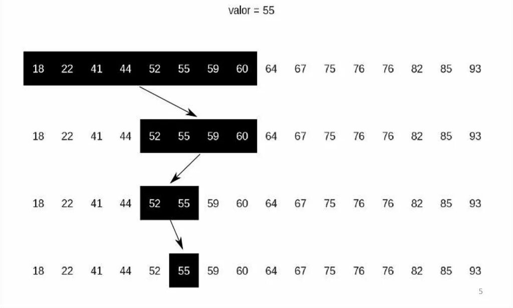
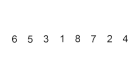
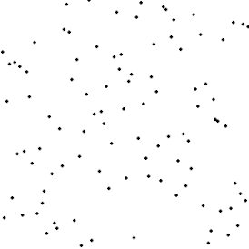

# Алгоритмы и структуры данных 

Посчитал репозиторий полезным? Поставь звезду

Данный репозиторий содержит мою реализацию структрур и алгоритмов обработки данных из соответствующего курса лекций МАИ, а так же мое вольное описание принципа работы Алгоритмов/структур, на достоверность не претендую.

## Навигация

- [Алгоритмы и структуры данных ](#алгоритмы-и-структуры-данных-)
  - [Навигация](#навигация)
  - [Алгоритмы обработки данных](#алгоритмы-обработки-данных)
    - [Поиск](#поиск)
      - [Сравнение алгоритмов поиска](#сравнение-алгоритмов-поиска)
      - [Линейный поиск](#линейный-поиск)
      - [Пограничный поиск](#пограничный-поиск)
      - [Двоичный поиск](#двоичный-поиск)
    - [Сортировка](#сортировка)
      - [Сравнение алгоритмов сортировки](#сравнение-алгоритмов-сортировки)
      - [Сортировка пузырьком](#сортировка-пузырьком)
      - [Сортировка вставками](#сортировка-вставками)
      - [Сортировка выбором](#сортировка-выбором)
      - [Сортировка слиянием](#сортировка-слиянием)
      - [Быстрая сортировка](#быстрая-сортировка)

## Алгоритмы обработки данных

Я буду рассматривать только алгоритмы *поиска* и *сортировки*, алгоритмы *оптимизации* оставлю на потом.

### Поиск

Глобально алгоритмы поиска элемента в массиве делятся на линейные и бинарные. Преимущество линейного поиска заклчается в том, что для его работы нет ограничения на входные данные: поиск может осуществляться как в отсортированом массиве, так и не отсортированном. Бинарный поиск работает быстрее (в худшем случае), но требует, чтобы исходный массив был отсортирован.

#### Сравнение алгоритмов поиска

| Тип | Название | лучший случай | худший случай | память |
|-|:-:|:-:|:-:|:-:|
| Линейный | LinearSearch | $\Omega(1)$ | $O(n)$ | $O(1)$ |
| Линейный | SentialSearch | $\Omega(1)$ | $O(n)$ | $O(1)$ |
| Бинарный | BinarySearch | $\Omega(\log(n))$ | $O(\log(n))$ | $O(1)$ |

#### Линейный поиск

Реализация [тут](https://github.com/artemilin-2023/Algorithms/blob/d902b9e2a85b5ab0832a85998bab512b2bb03d30/Algorithms/Searcher.cs#L12)

Классический линейный поиск. Принцип работы заключается в том, что в цикле поэлементно сравнивается текущее значение множества с искомым. Если мы перебрали весь исходный массив, а искомый элемент так и не нашелся, возвращается значение -1.

#### Пограничный поиск

Реализация [тут](https://github.com/artemilin-2023/Algorithms/blob/d902b9e2a85b5ab0832a85998bab512b2bb03d30/Algorithms/Searcher.cs#L30)

Принцип работы похож на обычный линейный поиск, за тем исключением, что время одной итерации меньше за счёт отсутствия проверки выхода за границу массива.

#### Двоичный поиск

Реализация [тут](https://github.com/artemilin-2023/Algorithms/blob/d902b9e2a85b5ab0832a85998bab512b2bb03d30/Algorithms/Searcher.cs#L53)

Идея заключается в том, что мы "сужаем" диапазон, в котором может находиться искомый элемент, учитывая то, что мы знаем, с какого индекса находятся элементы меньше искомого, а с какого - больше.

Алгоритм:

1. Определяется значение элемента в середине массива. Полученное значение сравнивается с искомым элементом.
2. Если искомый элемент меньше значения середины, то поиск осуществляется в первой половине элементов, иначе — во второй.
3. Поиск сводится к тому, что вновь определяется значение серединного элемента в выбранной половине и сравнивается с искомым элеменом.
4. Процесс продолжается до тех пор, пока не будет найден элемент со значением искомого или не станет пустым интервал для поиска.



### Сортировка

Алгоритмов сортировки существует множество, я рассмотрю только несколько наиболее популярных.

#### Сравнение алгоритмов сортировки

| Название | Средний случай | Худший случай | Память |
|-|:-:|:-:|:-:|
| Сортировка пузырьком | $O(n^2)$ | $O(n^2)$ | $O(1)$ |
| Сортировка вставками | $O(n^2)$ | $O(n^2)$ | $O(1)$ |
| Сортировка выбором | $O(n^2)$ | $O(n^2)$ | $O(1)$ |
| Сортировка слиянием | $O(n*log(n))$ | $O(n*log(n))$ | $O(n)$ |
| Быстрая сортировка | $O(n*log(n))$ | $O(n^2)$ | $O(log(n))$ |
| Параллельная сортировка слиянием | $O(n)$ | $O(n)$ | $O(n)$ |

#### Сортировка пузырьком

Реализация [тут](https://github.com/artemilin-2023/Algorithms/blob/c42a07fd36d09cd61f4c6b1b618804967504d7aa/Algorithms/Sorting.cs#L148)

Простейшая для реализации и понимания сортирровка. Принцип работы заключается в выполнении нескольких проходов по массиву: начиная от $i+1$ элемента, перебираются соседние пары. Если левый элемент пары больше правого, то они меняются местами (при сортировке по возрастанию).

Псевдокод:

``` C#
ЦИКЛ ДЛЯ I=0 ДО n-1 ШАГ 1
   ЦИКЛ ДЛЯ J=I+1 ДО n ШАГ 1
     ЕСЛИ A[J - 1] > A[j] ТО ОБМЕН A[j - 1], A[j]
   СЛЕДУЮЩЕЕ j
 СЛЕДУЮЩЕЕ I
```


#### Сортировка вставками

Реализация [тут](https://github.com/artemilin-2023/Algorithms/blob/c9cc8e6247f59298f6057e875037a2928cda9bd8/Algorithms/Sorting.cs#L168)

Изначально массив разделяется на отсортированную часть и неотсортированную, затем берется первый элемент из неотсортированной части и вставляется в нужное место в отсортированной. Это действие продолжается до тех пор, пока в неостортированной части не закончатся элементы.

Псевдокод:

``` py
for sorted in range(0, array.Count - 1)
    insert(array, sorted, sorted + 1)

def insert(array, endSortedPartIndex, itemIndex)
    // получение индекса вставки может быть реализовано разными способами, например - через бинарный поиск
    insertToIndex = getInsertToIndex(endSortedPartIndex, array[itemIndex]) 

    for i in range(itemIndex, insertToIndex, -1)
        swap(array[i], array[i - 1])
```



#### Сортировка выбором

Реализация [тут](https://github.com/artemilin-2023/Algorithms/blob/c9cc8e6247f59298f6057e875037a2928cda9bd8/Algorithms/Sorting.cs#L219)

Принцип очень прост: на каждой итерации берем текущий элемент и меняем его местами с минимальным элементам из множества, правее текущего элемента.

Псевдокод:

``` py
for i in range(0, array.Count - 1)
        min_index = i
        for j in range(i + 1, array.Count)
            if array[j] < array[min_index]:
                min_index = j
        swap(arary[i], array[min_index])
```




#### Сортировка слиянием

Реализация [тут](https://github.com/artemilin-2023/Algorithms/blob/2d928c6f43eaa0f106418dcab771d8dee2a72036/Algorithms/Sorting.cs#L12)

Идея заключается в объединении отсортированных множеств, это делается очень легко: первый элемент первого множества сравнивается с первым элементом второго множества, меньший из них добавляется в буфферный массив, а указатель добавленного элемента сдвигается вперед. Эти действия повторяются до тех пор, пока не сольются оба множества или одно из них не закончится. В случае, если одно из множеств закончилось раньше, чем другое, то оставшиеся элементы из множества добавляем в конец буфферного массива.

Алгоритм работает по приципу "разделяй и властвуй": исходное множество делится на две части, каждая из которых так же делится на две части. Когда часть множества состоит всего из одного (или нуля) элемента и делить дальше уже некуда, мы получаем отсортированное множество (множество из одного элемента по умолчанию отсортированно, а пустое - тем более). Затем наступает этап слияния двух уже отсортированных подможеств в одно большей размерности.

Псевдокод:

``` c
function mergesort(m)
    var list left, right, result
    if length(m) ≤ 1
        return m
    else
        middle = length(m) / 2
        for each x in m up to middle
            add x to left
        for each x in m after middle
            add x to right
        left = mergesort(left)
        right = mergesort(right)
        result = merge(left, right)
        return result
    end if

function merge(left,right)
    var list result
    while length(left) > 0 and length(right) > 0
        if first(left) ≤ first(right)
            append first(left) to result
            left = rest(left)
        else
            append first(right) to result
            right = rest(right)
        end if
    while length(left) > 0 
        append first(left) to result
        left = rest(left)
    while length(right) > 0 
        append first(right) to result
        right = rest(right)
    return result
```


#### Быстрая сортировка

Реализация [тут](https://github.com/artemilin-2023/Algorithms/blob/eebb48975802e5faca13d9d69f6b54efd0040bf5/Algorithms/Sorting.cs#L103)

Общая идея алгоритма состоит в следующем:

- Выбрать из массива элемент, называемый опорным. Это может быть любой из элементов массива. От выбора опорного элемента не зависит корректность алгоритма, но в отдельных случаях может сильно зависеть его эффективность.
Сравнить все остальные элементы с опорным и переставить их в массиве так, чтобы разбить массив на три непрерывных отрезка, следующих друг за другом: элементы "меньшие" опорного, "равные" и "большие".
- Для отрезков "меньших" и "больших" значений выполнить рекурсивно ту же последовательность операций, если длина отрезка больше единицы.
На практике массив обычно делят не на три, а на две части: например, "меньшие опорного" и "равные и большие"; такой подход в общем случае эффективнее, так как упрощает алгоритм разделения. В своей реализации я поступил именно так.

Псевдокод:

``` c
function quick_sort(array, left, right)
    if left >= right
        return
    end if

    var i, j, = left, right
    var pivot = array[left]
    while i <= j do
        while array[i] < pivot do
            i++
        end while
        while array[j] > pivot do
            j--
        end while

        if i <= j
            swap(array[i], array[j])
            i++
            j--
        end if
    end while

    quick_sort(array, left, j)
    quick_sort(array, i, right)
```


